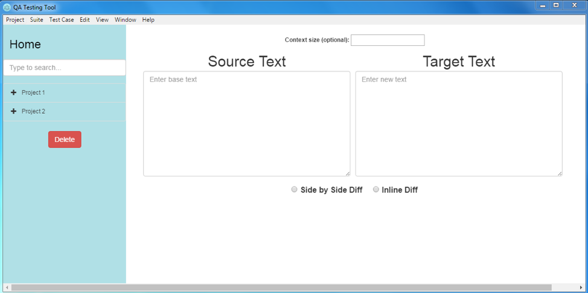

<!-- <a href="/project.html"><i title="Projects" class="fa fa-angle-left" style="color:#ffb400; font-size:40px;"></i></a> -->

## {{page.title}}

* * *

### Background
I designed and developed an Electron desktop application during my internship at Zenith. The purpose was to build a new application to replace an existing one, used by QA Analysts in Zenith’s IT department to compare data from two different data feeds after data migration.

### Defining the Problem
Information stored in a database is critical to all organizations for decision-making and predictive analysis. L&T Infotech’s Data Testing Framework (DTF) is a data validation and comparison framework that allows a user to perform data-centric testing. In Zenith, all kinds of data are moved from source database to target database every 30 minutes because of security reasons. In order to check and make sure the migration was successful, QA analysts run DTF daily. Due to DTF being a proprietary software, we decided to replace it with an in-house application.   

### Development Stage 1: Requirements Gathering
In the stage 1, I gathered all the requirements:
*	Add, delete and edit items (test cases, suites and projects)
*	Store items
*	Map columns
*	Connect to database
*	Execute queries
*	Load items to a tree view
*	Comparison of target query and source query
*	Create Excel summary reports

Since functionalities make use of projects, suites and test cases, it is important to understand these terms first. Below is the tree View of the Items displays an example of how project, suite and case items are structured using tree view. Tree view is a graphical display that represents a hierarchical view of items. Each item (will also be referred as node) can have a number of subitems. It is important to note that items refer to test case, suite and project.

```
Project 1 
	└── Project 1 - Suite 1 
	└── Project 1 - Suite 2
		└── Project 1 - Suite 2 – Test Case 1
		└── Project 1 - Suite 2 – Test Case 2
Project 2
	└── Project 2 - Suite 1 
	└── Project 2 - Suite 2
		└── Project 2 - Suite 2 – Test Case 1
		└── Project 2 - Suite 2 – Test Case 2
```
 
### Development Stage 2: Design & User Experience

#### Application Home Page
The application’s main browser window consists of two sections. First section is the navigation bar on the left hand side and the second section is the main content on the rest of the page. The navigation bar helps navigate the main content. The navigation bar has a “Home” button and when it is clicked, it displays a basic text comparison tool on the main content as shown below.  There is a search bar, which allows users to search for an item on the tree view, underneath the “Home” button. Tree view is the graphical display that represents a hierarchical view of items. When one of the tree view items is clicked, main content displays information about the selected item. The page that is loaded in the main browser window is index.html. With jQuery, developers can hide and show HTML elements with hide() and show() methods. In HTML, there is div tag that defines a division (or section) of a HTML document. The index.html is structured in a way that it has four separate divs. When one of the divs is shown, the other three are hidden and the buttons clicked by the user controls this. 




### Application Development Stage 3: Architecture 
#### File Structure
Application consists of node_modules folder, public folder, main.js file, nodes.txt file and package.json file. LICENSE.md and README.md files are not contributing to the execution of the application. 

This is how the application is structured:


The package.json file contains meta data about Zenith Data App. It also includes the list of dependencies to install from npm when running npm install. In Electron, the process that runs package.json’s main script is called the main process. The script that runs in the main process can display a GUI by creating web pages. There are three dependency node modules in the package.json. These three modules exist in “node_modules” folder. “oracledb” module allows connecting to the Oracle database through Electron. “simple-oracledb” module is an extension to “oracledb” module and enables handling many records by splitting the results into bulks. ”exceljs” module is an Excel workbook manager that allows writing reports in Excel format.   

The main.js file creates windows and handles system events. When Electron finishes initialization and the application is ready, main.js first creates a new browser window and then loads the index.html file into that window.  

All the projects, suites and test cases created by the user are stored in Node.txt file as a data structure in JSON format. 

The chronological order of the file calls:

```
package.json ──> main.js ──> public/pages/index.html   
```

The “public” folder is a bundle of frontend items. “css” folder holds the css files. “js” files holds the js files corresponding to each page (in the pages folder). The files in the “js” folder have the same name as the files in the “pages” folder. The only difference is that js files have “.js” extension whereas pages files have “.html” extension. For index.html file in the “pages” folder, there is a corresponding index.js file in the “js” folder. “js-common” folder has js files used commonly by every page. js-resources folder has the database connection related file. 

```json
{
  "name": "Zenith-data-app",
  "version": "0.1.0",
  "description": "A regression and testing desktop application built with Electron",
  "main": "main.js",
  "private": true,
  "scripts": {
    "start": "electron main.js"
  },
  "devDependencies": {
    "electron-prebuilt": "^1.2.0"
  },
  "dependencies": {
    "oracledb": "^1.11.0",
    "simple-oracledb": "^1.1.5",
    "exceljs": "^0.2.14"
  }
}
```

#### Entities
It is a good software engineering practice to use object-oriented programming (OOP). OOP provides a clear structure for programs that makes it easier to maintain and modify the code. OOP has a concept called objects. Objects are basic entities in the system. In JavaScript, an object is a standalone entity, with properties and type (Mozilla Developer Network, 2016). Constructor function of an object assigns values to the object's properties based on the values passed into it. In the case of Zenith Data App, there are three main objects; the project object, the suite object and the test case object. The constructor functions below act as classes. Instances of these objects are created when the addNewProject, addNewSuite and addNewCase functions are called, which will be mentioned later on. 

As shown below, the constructor function of the project object (projects-tree-controller.js) is instantiated with project definition and suites belong to that project. When a project is first created, there will be no suites associated with that project and thus the suites variable is usually an empty array. 

```js
function Project(projectDef, projectSuites) {
    this.def = projectDef;
    this.suites = projectSuites;
}
```

As shown in below, the constructor function of the suite object (projects-tree-controller.js) is instantiated with many more variables such as suite’s definition, cases belong to that suite, the parent of that suite (project name), source connection information (user name, password, host name, port name, sID) and target connection information (user name, password, host name, port name, sID). 

```js
function Suite(suiteDef, suiteCases, suiteParent, sUser, sPassword, sHost, sPort, sSID, tUser, tPassword, tHost, tPort, tSID) {
    this.def = suiteDef;
    this.parent = suiteParent;
    this.cases = suiteCases;
    this.sourceConn = {
        user: sUser,
        password: sPassword,
        host: sHost,
        port: sPort,
        sid: sSID
    };
    this.targetConn = {
        user: tUser,
        password: tPassword,
        host: tHost,
        port: tPort,
        sid: tSID
    };
}
```

As shown below, the constructor function of the test case object (projects-tree-controller.js) is instantiated with case’s definition, the parent of that case (suite name), the grandparent of that case (project name), source query, target query and mapping details. 

```js
function TestCase(caseDef, caseParent, caseGrandparent, sQuery, tQuery, caseMappingDetails) {
    this.def = caseDef;
    this.parent = caseParent;
    this.grandparent = caseGrandparent;
    this.sourceConn = {
        query: sQuery
    };
    this.targetConn = {
        query: tQuery
    };
    this.mappingDetails = caseMappingDetails;
}
```

#### Data Structure
Since JavaScript does not have dictionaries as a data structure, JavaScript objects are used as associative arrays. In order to keep track of each item, a “projects” object was initialized. The “projects” object consists of key-value pairs. The key in this case is the project name and corresponding value is the project object. As mentioned earlier, projects object is stored in a text file (node.txt). As seen in Figure 34, “getProjects” function takes the file name as a parameter and returns projects object. The “getProjects” function tries to read the file and if the file does not exist then it logs the error to the console. If the file exists, “getProjects” assigns the parsed value to projects variable. If type of the “projects” object is equal to “undefined”, then “getProjects” instantiates the project object. The JSON.parse() method parses a string as JSON, optionally transforming the value produced by parsing (Mozilla Developer Network, 2016).

```js
function getProjects(fileName){
    try {
      projects = JSON.parse(fs.readFileSync(fileName));
    } catch (e) {
      // Here you get the error when the file was not found,
      // but you also get any other error
        console.log("File could not be found");
    }
    if (typeof projects != 'undefined'){
        // do nothing
    }
    else {
        projects = {};
    }
    return projects;
}
```

<a href="/projects/Personal-Website.html"><i title="Back" class="fa fa-long-arrow-left" style="color:#ffb400;"></i></a>
<a href="/projects/Personal-Website.html" style="color:#ffb400;">Back to "tulinakdogan.com"</a>