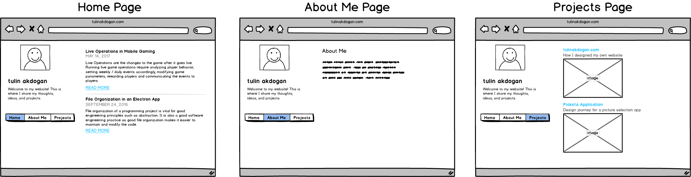
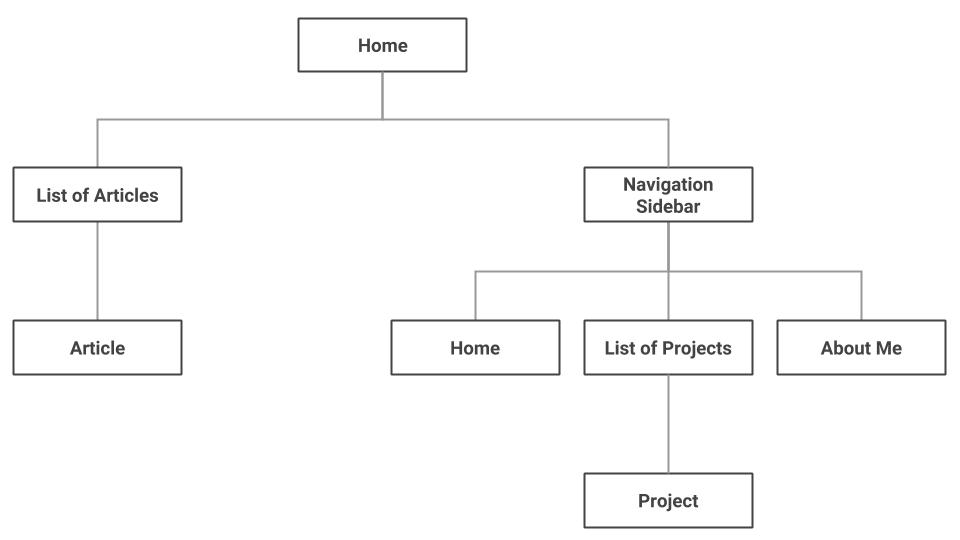
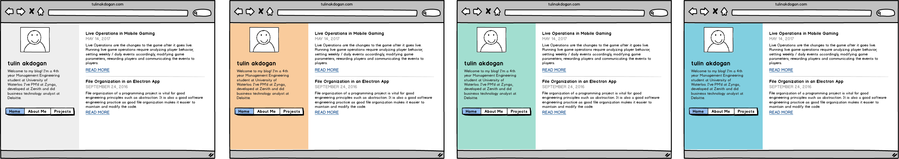
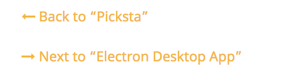
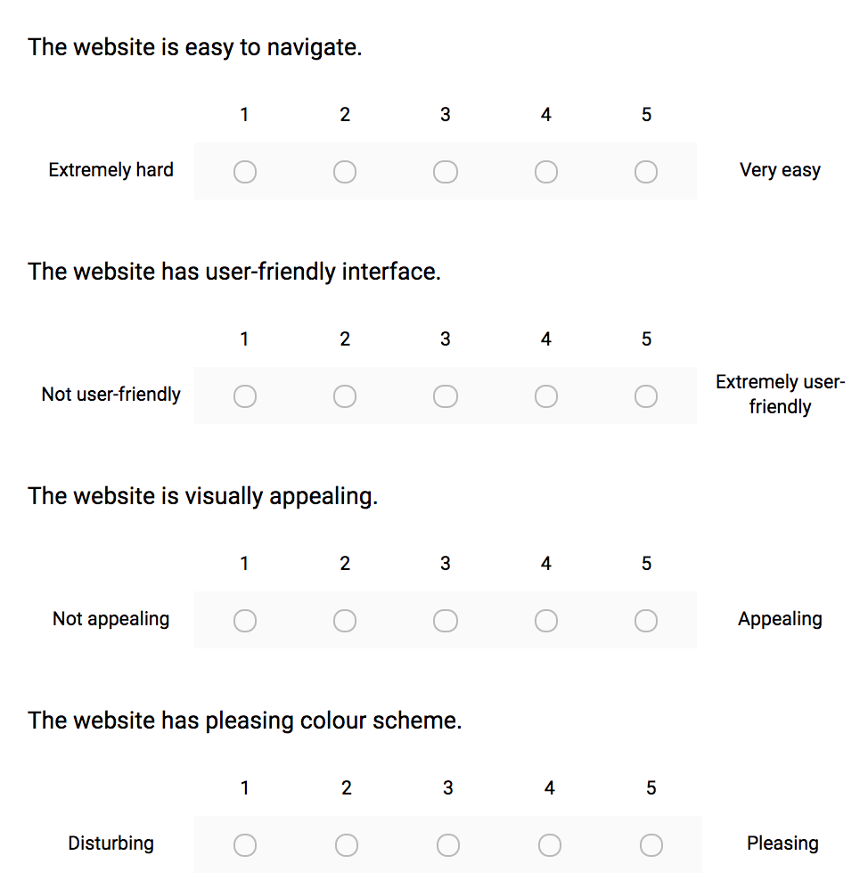

<!-- <a href="/project.html"><i title="Projects" class="fa fa-angle-left"></i></a>
<a href="/project.html/">Projects</a> -->
<!-- <a href="https://github.com/tulinn"><i title="Github" class="fa fa-angle-left" style="color:#ffb400; font-size:30px;"></i></a>  -->

## {{page.title}}

* * *

### Background
Designing a user-friendly website where I can show case my work using a minimalist approach and theme.

### Tools
*   Mockups via Balsamiq
*   Website via Github Pages and Jekyll 

### Key Concepts
*	Sidebar Container: for a brief intro and navigation purposes
*	Content Container: for show casing the actual work

### Logical Flow
I wanted to have three main sections: Articles, Projects and About Me. Through trial and error, I found the optimal way of displaying all three sections with a use of navigation sidebar. I care about organization as well as user experience. Thus, having all sections accessible via a persistent navigation bar that is visible to users at all times was the key. 

Here are the mockups to the website sections:

The users first lands on the Home page where a list of my blog articles are displayed. Every article item on the list has a title and a short description. There is a link that takes user to the article itself under the description. 

“About Me” section consists of a paragraph about me (who I am and the goal of my website). 

“Projects” section showcases my personal projects. Just like the "Articles" section, all the project items listed are clickable to be viewed in more detail. Every project on the list has a title, a short description and an image associated to it. When a project item is selected, a page related to that project opens. 

This is how the flow looks:

### Initial Prototyping
A low-fidelity mockup:

A high-fidelity mockup:

### Design Refinements
I made design refinements based on common human-computer interaction techniques as well as user tests. 

#### Typography
These are the fonts I considered for my website: "Noto Sans", "Helvetica Neue", "Helvetica", "Arial", "sans-serif" because they represent my style. Aside from legibility and readability, they are minimal, simple and determined. I want to convey less-formal, modern and friendly messages through this font. 

#### Color
After many trials, I decided to keep it simple and use white for background color. For titles, I used a dark gray color (#494949). As per font color, I used a gray (#727272), a slightly muted and more natural color close to light black, instead of pure black (#000000) for normal text. For subtle text such as article dates, I chose to use lighter gray tones (#A7AEB4) to have less emphasis on the date and more emphasis on the content. For link color, I decided to use a natural blue (#5bc0de). For hover, I used an accompanying orange(#ffb400). 

#### Background Color
I tried different background colors for the sidebar to separate the sidebar from the main section. Overall, I liked the light gray or the original look (no background color) as the strong colors came across confusing. I ended up keeping the original color and adding more colors to the titles instead. 

<!--  -->

#### Logo
I wanted to choose a simple but meaningful logo for my website and a moon outline does that very well. My logo follows the color scheme of the overall website.

My logo:

#### Containers
The website visually consists of two main containers: a sidebar container and a content container. On the content container, I’m planning to showcase my work (projects and blog writings). I designed the sidebar container to be fixed, as the main goal of the sidebar container is to help users navigate throughout the interface. On the sidebar header, there will be my name and my logo, as well as a brief description about my website. 

The sidebar container highlighted in purple: 

The content container highlighted in purple: 

#### Navigation
There is a navigation bar, with the links to the main sections of the portfolio, located on the sidebar container. The goal of the navigation bar is to ensure users can easily access the different sections of the website. The navigation bar (circled in purple) is shown below:

An additional navigation component was added under all the article and project items to allow a one-click transition across items. The arrows are chronologically ordered based on the date an item was added. 

This is how they look: 

   
### User Studies
I used the cognitive walkthrough approach to evaluate the design of my personal website and to make improvements. The usability tests were conducted on 4 diverse users (2 females and 2 males), all students from the University of Waterloo. All the students are in their early 20s. The goal of the usability test as well as the website were described to the user. Users were provided with a link to the website. Users were asked to talk about their feelings as they explore and discover functionalities. As they were stuck, I guided them to show how it works and kept taking notes of the feedback along the way. Users were given a list of tasks to complete. For each task, completion time was recorded. Users were also asked to pick different color versions of the website. 

#### Metrics
Quantifiable Metrics
*	Efficiency: Is it easy to navigate across the website from section to section? (does the user take long time to find the navigation buttons? 
*	Speed: How long does it take to complete a task? (record time it takes to complete a task)
*	Accuracy: Was the task done correctly? Keep track of the number of errors (wrong button clicks).

Qualitative Metrics
*	Satisfaction - Keep note of the feelings & comments as the user explores. 
*	Observe the user's reaction as they try to complete a task: are they enjoying, frustrated?
*	How do they feel about the navigation?

#### Preference Scale
Users were asked to fill in a post-usability test survey. This survey uses Likert scales to ask about more general opinions. 

#### Feedback from the Usability Test
*   The width of the sidebar was too large and thus occupying a lot of space when reading a blog article or viewing a project. 
*   The navigation links on the sidebar were not visible and it took them longer than usual to navigate across the website. Users also reflected frustration of not having a next button across articles. It seemed like a waste of time to go to home page to view the next article.  
*   The sidebar navigation buttons disappear as the users scroll down an article. It would be better to make the sidebar fixed. 
*   It would be better to differentiate each blog post from each other in the home page as it currently looks a little squished. 

Most users mentioned that the website colors could be more visually appealing. For the second part of the usability test, I showed some colored mockups to make the portfolio more visually appealing. Users thought some colors were too strong and thus distracting and they preferred softer colors across the website. They mostly preferred having the sidebar lightly colored or not colored at all. In general, users liked having the titles colored instead of a background color.  

#### Results
Majority of the users thought the website is easy to navigate and the website has a user-friendly interface. All users thought the website is somewhat visually appealing, representing the need for improvements. None of the users liked the current color scheme of the website which definitely calls for immediate action.  

### Next Steps
My website is under continuous development and maintenance, so there is always room for improvement.

*   My projects are pretty detailed. An outline would help the user track where they are at the whole article. 
*   A navigation button from a project item to the Projects section would be helpful.
*   The width of the sidebar could be smaller width-wise as it currently occupies much of space that could alternatively be used for the actual content such as a project article.

<a href="/projects/Picksta.html"><i title="Back" class="fa fa-long-arrow-left" style="color:#ffb400;"></i></a>
<a href="/projects/Picksta.html" style="color:#ffb400;">Back to "Picksta"</a>

<a href="/projects/Electron.html"><i title="Next" class="fa fa-long-arrow-right" style="color:#ffb400;"></i></a>
<a href="/projects/Electron.html" style="color:#ffb400;">Next to "Electron Desktop App"</a>
