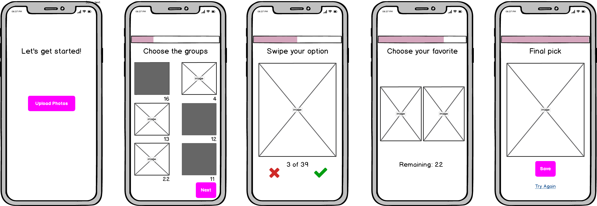
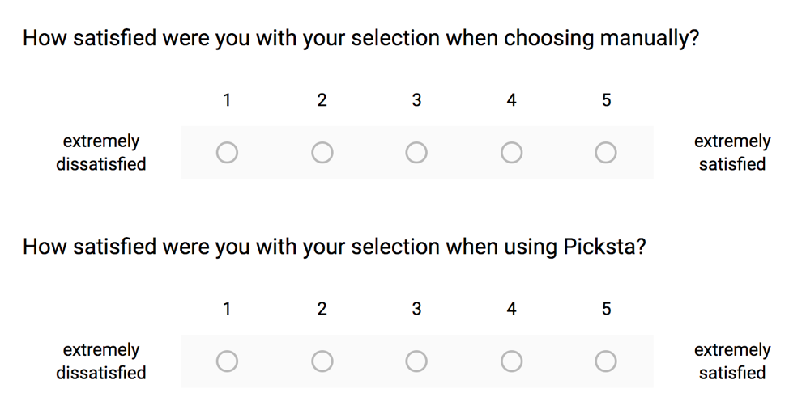

<!-- <a href="/project.html"><i title="Projects" class="fa fa-angle-left" style="color:#ffb400; font-size:40px;"></i></a> -->

## {{page.title}}

* * *

### Background
Picksta is an iOS application that helps users select their favorite picture from a group of pictures. Picksta was my fourth-year design project. 

### Tools
*   Mockups via Balsamiq
*   iOS App Development via Swift

### Defining the Problem
The increasing prevalence of portable technology, such as smartphones, has caused cameras to become integral to people’s lives. Due to the high quality-cameras on mobile devices, it is now cheaper and easier to take pictures. As a result of the ease of accessibility and low capture cost, people are taking far more photographs than ever before. Individuals often sort through masses of pictures in order to share worthwhile photographed moments with friends and family. This introduces an extremely time consuming and tedious process to narrow down options. 

### Our Vision & Solution
My team’s vision was to help users make quick, effective decisions when choosing a picture from a large set of pictures. We decided to tackle this issue by analyzing the steps taken to sort the photos in order to make a decision on the favorite picture selection. My team has developed an iOS application that efficiently guides users through critical decision-making steps to come to an optimal option.

### Conceptual Design
A variety of conceptual designs were considered before the team chose the final designs. Conceptual designs for application steps were evaluated based on enjoyability, efficiency, steps, satisfaction, and integration. The designs for the grouping algorithm were evaluated based off effectiveness, run-time, complexity of implementation, and generalizability. 

#### 1) Group and Delete
This is the first step to help reduce the number of pictures en masse. It starts by running a similarity algorithm on the uploaded pictures and grouping pictures that look similar to each other. There can be up to n number of groups, n being the number of pictures uploaded by the user. If the user decides they do not like a certain group, they can delete that group, effectively eliminating a potentially large number of photos from the process with the click of a button. The pictures in the remaining groups get passed onto the next step. 

#### 2) Narrow Down by Swipe
Three major designs were considered when deciding how users should narrow down their large set of pictures. First, swipe allows users to swipe right if they like the picture and want it to continue to the next step, or swipe left if they do not like it, and would not consider it as a final preference. Next, downsize by picking. This process allows users to pick a favourite set of pictures from the ones they have originally uploaded. For example, if a user uploads 60 pictures, they are asked to pick their favourite 40, and then their favourite 20 in order to move to the next step. Finally, ranking was considered. This process allows the user to see their set of pictures and rank them according to how favourable they are against one another. Only the top ranked pictures would be moved onto the next round. 

Based on the results of an evaluation matrix, the swiping option was the best choice for step 2. Not only is the functionality familiar to many users, but this was the most efficient option as well. The swipe logic increases the viewing speed which will be encouraged by the user interface of the application in order to go through many pictures at a fast pace 

#### 3) Side by Side Compare
In the third step, two pictures from the set that passed the previous step are presented to the user for comparison. The user is asked to tap the one they prefer, turning their decision making into micro-decisions of choosing between two pictures instead of multiple. The “untapped” picture disappears and is immediately replaced with another picture. This same process continues until only one picture remains and the user is presented with their top selection.  

### Design Development
Once the conceptual design decisions were finalized, my team worked on the details of each page. By using human-computer interaction design methods and user surveys – we were able to come up with the best design for an optimal process.

#### Iteration #1
My team used low-fidelity prototypes to test on users to understand how intuitive the design decisions were. This included asking the users what they thought would happen next if they clicked a certain button, what their focus was on the page they were looking at, and what they liked/disliked about the page. 

After collecting feedback, my team created the following mockups:

After testing this new design, my team found some factors that needed to be changed. It is difficult for users to know how many more steps remain for them to get to their final picture. It is also difficult to understand what to do next on the grouping page. This can make the users feel like they need to delete at least one group, when they really do not.

#### Iteration #2
My team decided to add a progress bar to resolve the issue of not knowing how far the user is from the final picture. The bar exists on each page in the same place, and multiple users commented on how they appreciated this during user tests. Another major change the group made is to change the grouping page to group and select instead of group and delete. The previous idea was that users would delete the groups they did not want to move forward. However, now the users will select the groups they want to keep, those will be highlighted, and a next button appears to show them that it is time to move on to the next step.

Changes shown below:

#### Iteration #3
The team decided to add information on the group, swipe and compare pages. The information provides users with knowledge of how many pictures are in each group, the amount the users need to swipe through, and how many pictures remain at the final stage of comparison.

Addition of information shown below:

### User Studies
We evaluated the design of our application through user testing.

#### Metrics
We determined three main metrics that would be the most useful in determining success. These were used to evaluate Picksta in the usability tests:
*	Enjoyability: how much fun the user has using the iOS application
*	Efficiency: measured by time it takes for the user to get through the process 
*	Satisfaction: how satisfied the user is with the final picture they have chosen from the set

#### Benchmark
The benchmark for Picksta was the manual picture selection process. Thus, the team measured metrics for both manual picture selection and the Picksta picture selection. This way, team was able to evaluate the success of the product.

#### Preference Scale
Users were asked to fill in a post-usability test survey. This survey uses Likert scales to ask about how confident the user was in their selection for both the manual and Picksta process.

In addition, the survey asked users if they would recommend Picksta to friends, and other questions about their experience with Picksta.

#### Planning
The usability tests were conducted on 18 diverse users, all students from the University of Waterloo. The user tests were conducted using two puppy picture sets of 20 pictures each. The first set had white puppies and the second had brown puppies. These sets were chosen in order to give users pictures they would hopefully feel more engaged with than other people’s vacation pictures of selfies and there needed to be one set for the manual process and one to be used with Picksta so that they were not just selecting the same picture in Picksta that they already selected in the manual process.

#### Task List
1.	User chooses their favorite dog picture manually on phone with white puppy set, record time and observations in spreadsheet
1.	Using the first puppy picture set (white puppies), allow the users to play around with Picksta and become familiar with the steps and how to use it
1.	User uses Picksta with the other set of dog pictures (brown puppies), to choose their favorite, record time and observations in spreadsheet

#### Validation and Verification
The design of Picksta was verified and validated through usability tests and accounting for edge cases. A pre-usability survey was created to understand how the users felt prior to trying the app. It started with an explanation of what the problem is that Picksta is trying to solve and how it solves it. Then it asks the user if they would use Picksta, how often and if they would be to pay one dollar for the app. It then goes on to ask the user’s age, if they are affected by the problem of selecting photos and if so it asks a little more about the nature of their problem (how many pictures are generally in the set they’re choosing from and average time spent selecting a picture). Users were given a user code to fill in on the pre and post survey. The code was also associated with the notes taken during their usability test so that all three components can be tied together for each user while preserving anonymity. 

#### Evaluation of the Usability Test
However, as the first few user studies were conducted, the team found that the users were taking a long time using Picksta and they deduced that it was because they were not familiar with it yet, and so the time was not an accurate reflection of how a user would generally use the app. Therefore, another step was added between the two steps above; using the first puppy picture set (white puppies), allow the users to play around with Picksta and become familiar with the steps and how to use it. Because of this, the team only considered the last 15 users that underwent the usability tests, as they were all given the chance to get familiar with the app first. Then the user was asked to take the post-usability test survey. Finally, the user was verbally asked if there was anything they wanted to mention that they had not had a chance to yet and their responses were noted in the spreadsheet.

#### Results
*   Usability tests found that 73% of users preferred Picksta over manually selecting a picture. 
*   The majority of users were 27% faster with Picksta versus the manual process. The team believes in reality this number would be much higher since users seemed to feel pressured in the tests to select a picture as fast as they can since the team was waiting for them and since the pictures are not their own, they are not as invested in what is selected. 
*   From other user interviews the team has heard about how long it can take people to select a picture to post, and often it would be upwards of 20 minutes. However, in our user studies, it took users no more than a few minutes to manually select a picture. 
*   Using the results from the likelihood for a user to recommend Picksta to a friend, the Net Promoter Score was calculated to be 20%. The average American company Net Promoter Score is under 10%. 

Additionally, results from the usability study helped the team refine the UI of the app and discover more edge cases. For example, if the user selects only one picture at any point of the process then they are taken directly to the last page in the process, the top selection page. 

#### Evaluation of Design
The advantages of the design are that it emulates the way users generally intuitively want to narrow down their pictures. Also, the steps are simple and incorporate steps already in the majority of users’ mental model, such as the “Tinder” swipe step. The design lets the process become much easier and more efficient. The shortcomings of the design are that it could be seen as over-constraining for the small percentage of users who select a picture in a drastically different way. Finally, the risks of the design are that the learning curve is still too steep for people to feel like the time it takes to learn the app is worth it instead of simply doing the manual selection process that they are already familiar with.

<a href="/projects/Personal-Website.html"><i title="Next" class="fa fa-long-arrow-right" style="color:#ffb400;"></i></a>
<a href="/projects/Personal-Website.html" style="color:#ffb400;">Next to "tulinakdogan.com"</a>